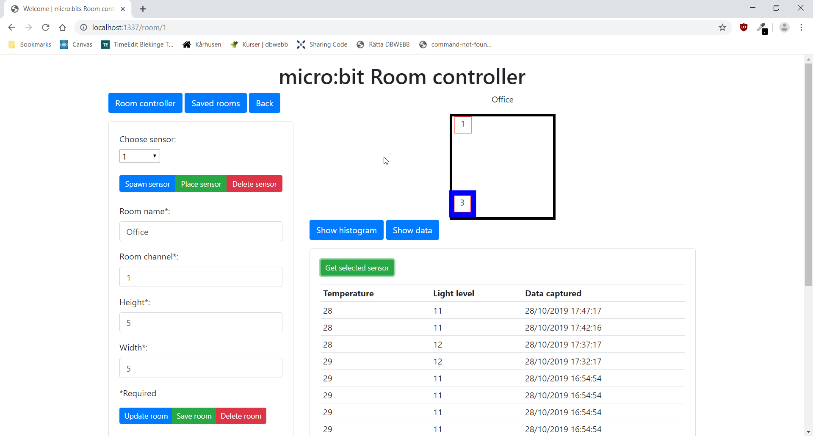

# micro:bits - webapp

This is a readme for setting up the webapp associated to a project regarding micro:bit sensors.
Some features are:

* Input measurements to get a copy of a real life room.
* Place sensors in a "room" for future reference where the user put the sensor.
* Show data from all sensor associated to that room or just an individual sensor.



## Language

* HTML
* Javascript
* Node.js
* Express

## Installation

Start by checking if node and npm is installed.

```bash
node -v
npm -v
```

If node isn't installed, use this [link](https://nodejs.org/en/download/).
If just npm is missing it can be installed with:

```bash
[sudo] npm install npm -g
```

With that out of the way you have to install the modules from the package.json.

```bash
npm install
```

You are now ready to go!

## Usage

To start the server use:
```bash
node index.js
```
Or if nodemon is installed:
```bash
npm start
```
